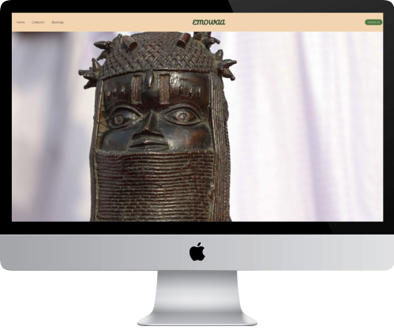
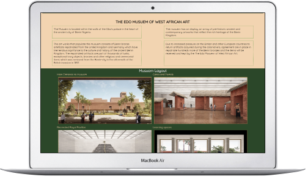
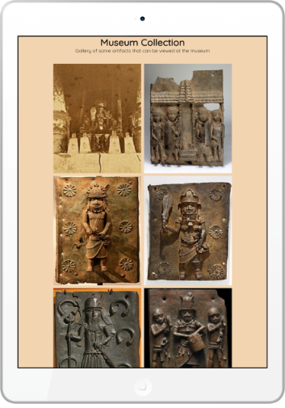
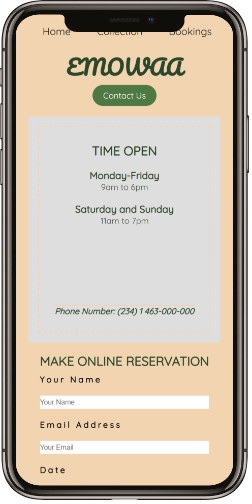

# EMOWAA

## Table of Contents
1. [General Information](#General-information)
2. [Technologies](#Technologies)
3. [Testing](#Testing)
4. [Depolyment](#Depolyment)
5. [Credits](#Credits)
***

## General Information

**EMOWAA** is an illustrative website about a museum that houses a collection of artefacts and imagery (primarily Bronze and copper carvings from the ancient Benin Kingdom). Although, the museum only exists presently as an idea/proposal, this website aims to provide insight on a probable collection of artefacts to be housed in the hypotehtical museum.

The website also aims to serve as a guide to the structural layout of the museum and provide a platform which guests can have a sneak preview of the collection of artefacts on display and schedule a tour of the museum. View the live site [here]( https://deenafe.github.io/edomuseum/)

### **Screenshots**

        
  

### **Features**

### *Navigation*  

* The navigation menu is consistent in all 3 pages of the website and links to the Home, Collection, Bookings page and the Logo which directs to the Home page.
* This will allow users to easily navigate across the pages without having to use the "back" button

### Landing Page 

 #### *The Landing page image*  
 *   The landing page include a picture of one the most valuable bronze artefacts in the history of Benin Kingdom
    The provides a visual clue to the user that the museum has noteworthy artefacts on display

    

  ####  *Museum Information*  
  *   This section aims to provide users with information on the location of the museum and importance of the artworks on display
 *   It also provides a bit of background information on the source of artefacts on display

 

  ####  *Museum Layout*  
  *   This aims to provide a visual illustration of various sections of the museum
  *   It is meant to help users get a hint of layout of the museum prior to booking a visit.

  

  ####  *Footer*
  *   This contains links to four social media platforms that will be displayed as icons. All the links will open in new tabs, so users don't have to leave the website to access the social nedia websites.
  *    The footer is important to enable users connect via social media to get latest information about the museum and new artefacts on display.

### Gallery Page  

   #### *Gallery*

  *  The gallery contains images of some of the important imagrey and artefacts on display.
  *  It's intended to provide a sneak preview of what is on display at the museum.

### Booking Page  

 #### *Open Times and Reservations*

 *   This page provide information on the open days and open times to the user as well a phone contact number.
 *   It provides users with a platform to book a tour of the museum and users are be required to input their Names, Email Address, Intended date and time of visit, and number of persons coming on the visit.

 

 ### Contact Page  

 #### *Contact Form*

 *   A contact form which allows users to input their names, email address and message.
 *   It enables users to contact the museum if they have any enquiries outside the scope of information provided on the website.

### Existing Features  

* Information on museum 
* Responsive gallery
* Responsive design
* Captions for gallery pictures
* Reservation page
* Contact form

### Features Left to Implement  

* An interactve map to help users get the precise location of the museum

* A slide show of the main image on the landing page to consist of at least 5 diffrent images of related artefacts.

* A modal to be added to the collection page, so when clicked, each image can be displayed on top of the gallery with a caption.

***

## Technologies  
*** 

  **HTML**
   * The structure of the web pages was done using html. 

   **CSS**
   * The decorative features of the web pages was done using CSS in an external file.

   **Font Awesome**
   * The social media icons was sourced from https://fontawesome.com/ 

   **Gitpod Workpspace**
  *  Used to commit and push code during the development of the Website.

  **GitHub**
  *  Code is hosted and deployed on GitHub.

***
## Testing   

***

   ### Responsiveness   
     All the pages were tested for responsiveness on various device screens ranging from 280px and above
    
    The website is responsive on the following devices:

  ###  Accessibility  
     To ensure that the website meets the WCAG Web Accessibilty Standards, [Wave](https://wave.webaim.org/) was used to the results of the accessibility testing showed that the following were met:

     * There were no color contrast errors in all the pages.
     * The heading elements are properly structured to facilitate page navigation for users of assistive technologies.
     * All form labels are present and associated with a form control.
     * The HTML lang arrtibute is present to allow screen readers to read the content appropriately.
     * Images and external links have associated alternative text and aria-labels to be read by screen readers.

     The objective of performing the accessibility testing was to ensure the website is:

     * Perceivable
     * Operable
     *Understandable
     *Robust

    However, due to time constraints, I was unable to conduct the manual testing for accessibility using a screen reader.

## Validator Testing   

*HTML*
* No errors were returned when passing through the official [W3C validator](https://validator.w3.org/)

*CSS*
* No errors were found when passing through the official [(Jigsaw) validator](https://jigsaw.w3.org/css-validator/)

### Unfixed Bugs   
There was no identifiable bugs.

***
## Deployment 
***

### Github Pages

**The site was deployed to GitHub pages. The steps to deploy are as follows:**

* In the GitHub repository, navigate to the Settings tab
* From the menu on left select 'Pages'
* Click 'Save'
* The live link will be found with the message "Your site is live at" -  https://deenafe.github.io/edomuseum/

### Clone the Repository Code Locally  

**Navigate to the GitHub Repository you want to clone to use locally:**

* Click on the code drop down button
* Click on HTTPS
* Copy the repository link to the clipboard
* Open your IDE of choice (git must be installed for the next steps)
* Type git clone copied-git-url into the IDE terminal

***
## Credits  
***

### Content  

*  The idea for the creation of the museum is from the EMOWAA Trust headed by Phillip Ihenacho.
  
*  Guidance to create a responsive gallery using flexbox was from a [Youtube Tutorial video by "Cem Eygi Media"](https://www.youtube.com/watch?v=QmZNFnqwu74).

*  Guidance to build a booking page containing Open Times and booking form was from a [Youtube Tutorial video by "brilex 007"](https://www.youtube.com/watch?v=ShpH_1EPox0) .

### Media   

*  The main image and photos in the gallery are from Wikipedia and https://smarthistory.org/imagery-power-benin-bronze-plaques/ .

 * The concept for the museum layout originally belong to David Adjaye who is a renowed architect and I got the images of an article written by Alex Greenberger for [Artnews](https://www.artnews.com/gallery/art-news/photos/david-adjaye-emowaa-benin-city-designs-1234576585/5_education-spaces/).  
